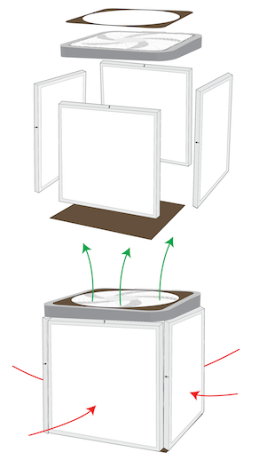

### tmcknew.github.io
# Let's clean some air!

This page is a collection of resources for making Corsi-Rosenthal Cubes (or Comparetto cubes). A simple, inexpensive and effective air cleaner can be made with a 20" box fan, a few 20" furnace filters, and some tape. These devices can be used to reduce the transmission risk of airborne pathogens, as well as removing hamful particulate matter. 

Cost per unit is approx $20 for the box fan, $10-15 per filter (units can be built with up to 5 filters, more filters will mean more throughput and more clean air), and about 30 feet of 2-inch tape. A full cube design (5 filters plus fan) will cost around $80 with a good source of filters, and will probably outperform the best consumer-level air cleaners available.

## Construction

Figure 2. A visual guide to constructing a Corsi-Rosenthal cube with a box fan and MERV filters with a top fan configuration. Air is pulled into filters (red arrows) and blows out of fan (green arrows). Photo by [CC-BY al.hu](https://www.flickr.com/photos/23309579@N04/51335349886/in/dateposted-public/).

[Corsi-Rosenthal Cube at Encycla.com](https://encycla.com/Corsi-Rosenthal_Cube) is a good resource with a Construction guide, Filter brands to potentially avoid, Variations, History, Room sizing & placement, Power usage, noise & safety, and News / media stories.

## Safety
Filtering the intake of a box fan will increase the load on the motor running the fan, so it will reach higher temperatures than if used in the open. [An Evaluation of DIY Air Filtration](https://chemicalinsights.org/wp-content/uploads/DIY-Box-Fan-Report-2021.pdf?utm_source=Chemical+Insights&utm_campaign=d52ba63ea8-July_2021_Newsletter7_13_2021_13_4&utm_medium=email&utm_term=0_09fecf83d2-d52ba63ea8-119531236) is a study of box fan/filter constructions with an eye toward fire safety, the resulting conclusion: 
`Overall, all measured temperatures of the fans under the conditions described in this study were lower than the maximum allowable
temperatures in UL 507.`

## More Reading

[Physicist, Non-Profits Test Air Purifiers to Promote Health and Learning](https://www.youtube.com/watch?v=A7B7t4DUMOA) is a short video at Youtube from [https://cleanarair.com/](https://cleanarair.com/), which also has lesson plans and lots more!

[A Variation on the “Box Fan with MERV 13 Filter” Air Cleaner](https://www.texairfilters.com/a-variation-on-the-box-fan-with-merv-13-filter-air-cleaner/) article at textairfilters.com covers some design history and airflow testing, as well as links to other relevant articles 

An [article at Wired magazine](https://www.wired.com/story/could-a-janky-jury-rigged-air-purifier-help-fight-covid-19/) helped popularize the design, and has some good background.